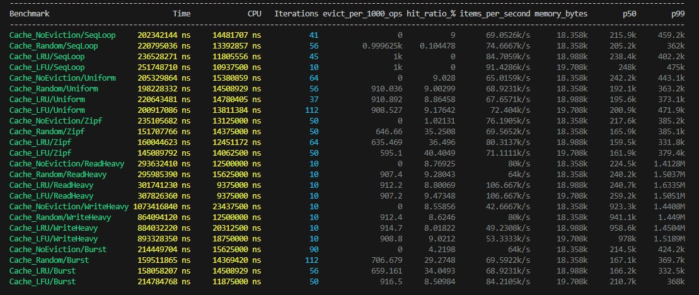

# Key-Value-DB
## Сравнение политик вытеснения (LRU, LFU, Random, Noeviction) в потокобезопасном in-memory кэше на различных профилях нагрузки

**Цель исследования** — определить оптимальную политику вытеснения для каждого типа
рабочей нагрузки на основе объективных метрик (hit ratio, latency, throughput).

**Задачи работы:**
1. Реализация потокобезопасного кэша.
2. Реализация четырёх политик вытеснения: LRU, LFU, Random, Noeviction.
3. Реализация механизма TTL.
4. Разработка бенчмарка с параметризуемыми профилями нагрузки.
5. Проведение экспериментальных замеров и анализ полученных результатов.

### Теоретический обзор
#### Политики вытеснения
- LRU
Вытесняется запись, к которой дольше всего не обращались.

- LFU
Вытесняется запись, к которой обращались реже всего.

- Random
Вытесняется случайная запись.

- Noeviction
Записи из кэша не вытесняются.
Если кэш заполнен, но нужного ключа в нем нет -- не кэшировать результат, но вернуть его вызывающему коду

#### Метрики

- **Hit ratio**
Доля операций чтения, для которых значение было найдено в кэше.
$HitRatio = \frac{Hits}{Hits + Misses}$
Hit: ключ найден, его срок TTL не истёк, и значение успешно возвращено.
Miss: ключ отсутствует, был вытеснен, или ключ присутствовал, но TTL истек.

Операции Put в Hit Ratio не входят.

- **Throughput**
Количество завершённых операций в единицу времени:
$Throughput = \frac{CompletedOperations}{MeasuredTime}$

По возможности из измеряемого времени исключаются создание кэша, создание потоков, генерация тестовой последовательности, заполнение исходных данных, сохранение результатов, сортировка latency и вывод в консоль.

Измеряемый интервал должен содержать только выполнение профиля нагрузки.

- **p50/p99 latency**
Latency -- время выполнения одной операции.
p50 -- медиана задержки. Это означает, что приблизительно половина операций Get завершилась не медленнее p50, а половина -- не быстрее.
Аналогично p99 -- значение, быстрее которого завершилось 99% операций.

- **Eviction count**
Количество вытеснений элементов, удалённых из-за того, что кэш достиг ограничения по размеру и потребовалось освободить место. Noeviction не делает вытеснений, поэтому для него eviction count = 0 всегда.

- **Memory estimate**
Оценка памяти, занимаемой кэшем вместе с данными и служебными структурами политики.
LRU и LFU могут иметь высокий hit ratio и throughput, но требуют хранения дополнительных данных, поэтому обычно проигрывают в этом параметре random и noeviction.

#### Профили нагрузки

- **Uniform**
Каждая операция выбирает ключ случайно с одинаковой вероятностью из заданного диапазона.

Uniform моделирует систему, где нет горячих ключей, популярность объектов примерно одинакова, предыдущие обращения почти не помогают предсказать следующие.

В реальных системах идеально равномерная нагрузка встречается редко. Она полезна прежде всего как базовый и неблагоприятный для интеллектуальных политик сценарий.

Ожидается, что из-за одинаковой вероятности выбора ключей, затраты памяти на дополнительные данные LRU и LFU будут неоправданными. Также ожидается, что random политика вытеснения будет иметь меньшее значение throughput и memory estimate.

- **Zipf**
Ключи выбираются с неравномерной вероятностью: небольшая группа ключей получает большую часть обращений.

Вероятность ключа с рангом k:

$P(k)=\frac{1/k^s}{\sum_{i=1}^{N}1/i^s}$, где N -- размер пространства ключей, s -- параметр перекоса.
Чем больше s, тем сильнее нагрузка сосредоточена на популярных ключах.
Zipf хорошо описывает системы с горячими объектами: «небольшая часть объектов получает большую часть обращений».

Random может вытеснять популярные ключи, его hit ratio зависит от соотношения количества горячих ключей и ключей в кэше -- чем больше вероятность вытеснить горячий ключ, тем больше будет eviction. Ожидается, что LRU и LFU будут работать быстро и покажут высокий hit ratio. Результат работы noeviction будет зависеть от того, попадут ли популярные ключи в кэш. Если да, то Noeviction чуть уступит LRU LFU, но все еще даст высокий hit ratio и thoughput.

- **Sequential Loop**
Ключи перебираются последовательно, а после достижения конца диапазона цикл начинается заново. Этот профиль проверяет устойчивость политики к загрязнению кэша потоком элементов, которые не успевают использоваться повторно.
Если количество запрашиваемых в последовательности ключей больше, чем вмещает в себя кэш, LRU может зациклить вытеснения и hit ratio будет стремиться к 0. Поэтому ожидается, что Random может дать более высокий hit ratio, так как вероятность цикла крайне мала. LFU потенциально может дать результат, близкий к Random. Hit ratio Noeviction будет зависеть от соотношения размера кэша и количества ключей последовательности.

- **Read-Heavy (Uniform)**
95% операции чтения, 5% операции записи.

- **Write-Heavy (Uniform)**
80% операции записи, 20% операции чтения.

- **Burst (Zipf)**
3 раза меняется набор горячих ключей.

#### Многопоточность

- **std::mutex**
Мьютекс предотвращает одновременный доступ нескольких потоков к ресурсу. Мьютекс можно захватывать (lock) и отпускать (unlock). Пока один поток захватил мьютекс, любой другой поток при попытке захвата засыпает и ждёт своей очереди.

- **std::shared_mutex**
Разделяемый мьютекс имеет два уровня доступа: эксклюзивный (запись) и разделяемый (чтение).

Запись: Только один поток может захватывать shared_mutex на запись через `.lock()`.

Чтение: Несколько потоков могут захватывать shared_mutex на чтение через `.lock_shared()`.

Пока один поток захватил мьютекс на запись, другие потоки не могут делать ничего. Пока какие-то потоки захватили мьютекс на чтение, другие потоки не могут захватить его на запись.

Ожидается, что разделяемый мьютекс подойдёт для read-heavy профилей, когда операций чтения гораздо больше, чем операций записи. Однако при write-heavy оверхед разделяемого мьютекса окажется неоправданным.

- **Lock Striping**
Лок-страйпинг -- замена одного мьютекса на весь массив данных множеством мьютексов. Позволяет решить проблему, когда большое количество потоков пытается взаимодействовать с малым количеством мьютексов. 

Важно учитывать соразмерность количества мьютексов и количества потоков. При слишком малом относительном количестве мьютексов ожидается частое простаивание потоков. При чрезмерном количестве относительном мьютексов (например, в десять раз больше количества потоков) ожидается неоправданный оверхед по памяти, ведь каждый мьютекс занимает какое-то количество. Ожидается, что оптимальное количество мюьтексов будет примерно равным или лишь в несколько раз большим, чем количество потоков.

Презентация защиты https://docs.google.com/presentation/d/1rJgHQuPD_4cuqYzDiZQKkfFpQHUa5CWm/edit?slide=id.g3ef2583b613_0_21#slide=id.g3ef2583b613_0_21
Команда:
Соболева Софья, Баев Артур -- разработка бенчмарка, проектирование профилей нагрузки, сбор и анализ метрик (hit ratio, latency, throughput)
Барг Родион, Бекренев Георгий -- 	реализация многопоточности, обеспечение потокобезопасности кэша
Шакиров Михаил -- реализация базового хранилища и механизма TTL
